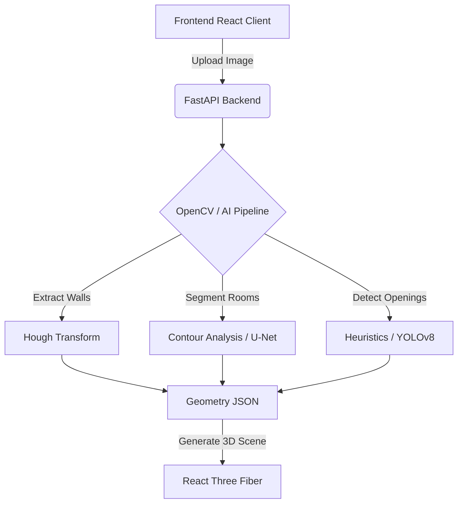

# MetaNest

[](https://opensource.org/licenses/MIT)
[](https://www.python.org/downloads/)
[](https://reactjs.org/)

MetaNest (HomeScape AI) is a powerful, AI-assisted pipeline that converts 2D floor plans into interactive, browser-based 3D metaverse environments. It combines a FastAPI and OpenCV backend with a React, Tailwind CSS, and React Three Fiber frontend.

## Features

- **2D Editor & Viewer:** Draw walls, add doors/windows/furniture manually, or instantly view generated plans in 3D.
- **AI Vision Pipeline:** Upload JPG, PNG, or PDF blueprints and let the OpenCV pipeline automatically extract walls, detect room regions, and find openings.
- **Interactive Metaverse:** Walk through your home in first-person mode, or explore it via top-down and orbit cameras.
- **Dynamic Materials:** Customize wall colors, floor textures, and enable realistic sunlight simulation.
- **Export Ready:** Download the generated 3D scene data as a standard JSON payload.
- **Extensible AI:** Built-in hooks for integrating custom trained YOLOv8 (for doors/windows) and U-Net (for room segmentation) models.

## Architecture Overview



## Quick Start

### 1. Backend Setup

From the project root, open a terminal and run:

```bash
cd backend
python -m venv .venv
.venv\Scripts\activate       # On Windows
# source .venv/bin/activate  # On macOS/Linux
pip install -r requirements.txt
copy .env.example .env       # cp .env.example .env on macOS/Linux
uvicorn app.main:app --reload --port 8000
```
The API is now running at `http://localhost:8000`.

### 2. Frontend Setup

Open a **new** terminal window and run:

```bash
cd frontend
npm install
npm run dev
```
The application is now running at `http://localhost:5173`.

### 3. Demo Data

We have included a set of synthetic floor plans for testing. You can use the `Load Demo` button on the frontend or manually upload images located in `docs/demo-assets/dummy_raw/images`.

## Advanced Configuration

### Optional MongoDB Database
By default, projects and layouts are stored locally in a `backend/data/projects.json` file. To use MongoDB for persistence (ideal for production):
1. Create a cluster on MongoDB Atlas or run a local instance.
2. Edit `backend/.env` and set `MONGODB_URI` and `MONGODB_DATABASE`.

### Optional AI Training
The default application runs perfectly without GPUs using OpenCV heuristics. For production accuracy, you can train and plug in deep learning models:
See `docs/AI_TRAINING_NEXT_STEPS.md` for a comprehensive guide on preparing datasets and training YOLOv8/U-Net models for MetaNest.

## Contributing

See [CONTRIBUTING.md](CONTRIBUTING.md) for information about development workflows, code style, and submitting pull requests.

## License

This project is licensed under the [MIT License](LICENSE).
